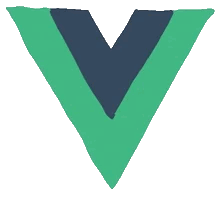
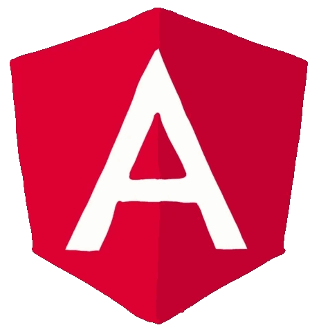
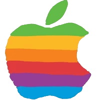

<h1 align="center">Hi 👋, I'm Debi Prasad Beura</h1>

<h3 align="center">
🚀 Full Stack Developer | Java Enthusiast | Problem Solver
</h3>

 

  

 

## 💫 About Me

🎓 Computer Science Student

💻 Passionate about Full Stack Development

🧠 Solving DSA problems regularly

📚 Exploring System Design & Cloud Technologies

🚀 Currently Building: **Placement Diaries Platform**

### Placement Diaries Platform

A complete placement preparation ecosystem featuring:

- Resume Builder
- Resume Hosting
- Interview Experiences
- Company-wise Preparation
- Student Dashboard
- Analytics & Insights
- AI-powered Features

---

## 🌐 Connect With Me

---

## ⚡ Tech Stack

### Languages

### Frontend

### Backend

### Database

### Tools & Version Control

---

## 🚀 Featured Projects

### 🎥 YouTube Spam Filter

AI-powered spam detection system that identifies and filters unwanted comments from YouTube discussions.

### 📄 Resume Hosting Platform

Generate, host and share resumes through a permanent public URL.

### 🎯 Placement Diaries

A complete placement ecosystem helping students prepare and track placement journeys.

---

## 📊 GitHub Stats

---

## 🔥 GitHub Streak

---

## 📈 Contribution Graph

---

## 💡 Quote

### "Consistency beats intensity."

